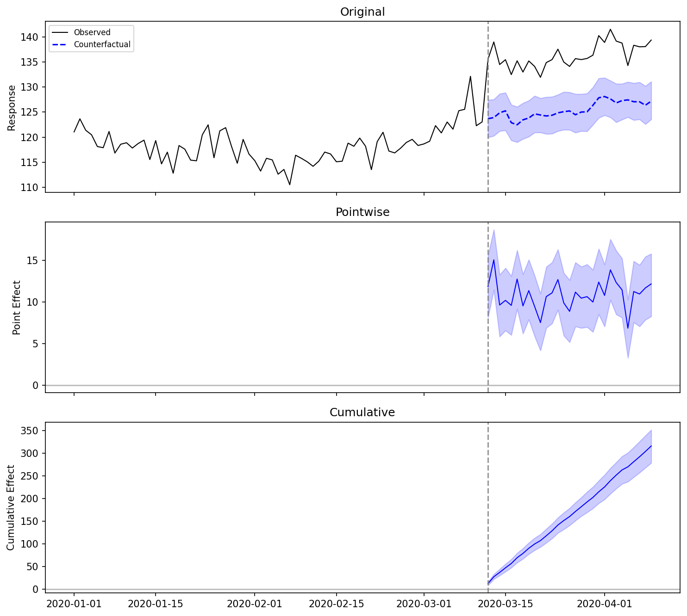

# bsts-causalimpact

[](https://pypi.org/project/bsts-causalimpact/)
[](https://pypi.org/project/bsts-causalimpact/)
[](LICENSE)
[](https://github.com/YuminosukeSato/bsts-causalimpact/actions/workflows/numerical-equivalence.yml)

Bayesian structural time series for causal inference in Python.
A faithful port of Google's [CausalImpact](https://google.github.io/CausalImpact/) R package. No TensorFlow required.

The Gibbs sampler is implemented in Rust (via PyO3), reproducing the same algorithm as R's `bsts` package while achieving 10-30x speedup.

## When to Use (and When Not to)

This method is valid only when all of the following hold:

- Control series are not contaminated by the intervention
- The relationship between treated and control series is stable across the pre- and post-intervention periods
- The pre-intervention period is sufficiently long (rule of thumb: at least 3x the post-intervention period)

If any of these assumptions are violated, the causal estimate will be unreliable. Consider a difference-in-differences or synthetic control approach instead.

## Installation

Requires Python 3.10+.
Binary wheels are intended for supported platforms, so Rust is only required
when building from source.

```bash
pip install bsts-causalimpact
```

For development (builds Rust extension locally):

```bash
git clone https://github.com/YuminosukeSato/bsts-causalimpact.git
cd bsts-causalimpact

# Install with uv (recommended)
uv sync --all-extras

# Or install with pip (builds Rust extension via maturin)
pip install -e ".[dev]"
```

## Quick Start

```python
import pandas as pd
from causal_impact import CausalImpact

# Prepare your data: first column = response, remaining columns = covariates
data = pd.read_csv("your_data.csv", index_col="date", parse_dates=True)

# Define pre- and post-intervention periods
pre_period = ["2020-01-01", "2020-03-14"]
post_period = ["2020-03-15", "2020-04-14"]

# Run the analysis
ci = CausalImpact(data, pre_period, post_period)

# Print a summary table
print(ci.summary())

# Print a narrative report
print(ci.report())

# Plot the results
fig = ci.plot()
fig.savefig("causal_impact.png")
```

### Example Output



```
Posterior inference {CausalImpact}

                         Average        Cumulative
Actual                   136.32          3953.19
Prediction (s.d.)        125.42 (0.66)   3637.07 (19.08)
95% CI                   [124.18, 126.71]  [3601.33, 3674.59]

Absolute effect (s.d.)   10.90 (0.66)    316.13 (19.08)
95% CI                   [9.61, 12.13]   [278.60, 351.86]

Relative effect (s.d.)   8.69% (0.57%) 8.69% (0.57%)
95% CI                   [7.58%, 9.77%] [7.58%, 9.77%]

Posterior tail-area probability p: 0.001
Posterior prob. of a causal effect: 99.90%
```

## Comparison with Alternatives

| | R CausalImpact | bsts-causalimpact (this) | tfp-causalimpact | tfcausalimpact | pycausalimpact |
|---|---|---|---|---|---|
| Maintainer | Google | OSS | Google | WillianFuks | dafiti (stale) |
| Algorithm | Gibbs (bsts/C++) | Gibbs (Rust) | TFP-based | VI default / HMC | MLE (statsmodels) |
| Dependencies | R, bsts | numpy, pandas, matplotlib | TF, TFP (3 GB+) | TF, TFP (3 GB+) | statsmodels |
| Spike-and-slab | Yes | Yes | Unknown | No | No |
| Seasonal component | Yes | Yes (`nseasons`, `season_duration`) | Unknown | Yes (TFP STS) | No |
| Dynamic regression | Yes | Yes (`dynamic_regression=True`) | Unknown | No | No |
| R numerical test | Reference | CI-enforced | Not published | Visual comparison | Not tested |
| Speed (T=1000) | 2.1 s | 0.07 s (30x) | Seconds | Minutes (HMC: hours) | Sub-second |
| Python version | N/A (R) | 3.10+ | 3.8+ | 3.7-3.11 | 3.6-3.8 (stale) |
| Last release | Active | Active | 2023 | 2025-01 | 2020-05 |

### Why this library exists

Existing Python ports have fundamental limitations:

- pycausalimpact uses MLE (not MCMC), producing results that diverge substantially from R
- tfcausalimpact uses variational inference by default (not Gibbs sampling), and requires TensorFlow (3 GB+)
- tfp-causalimpact (Google's own Python port) does not publish numerical equivalence tests with R
- None of the above implement spike-and-slab variable selection matching R's bsts

This library reproduces the core Gibbs-sampler workflow from R's bsts package in Rust, with CI-enforced numerical equivalence tests on every commit.

## Numerical Equivalence with R

[](https://github.com/YuminosukeSato/bsts-causalimpact/actions/workflows/numerical-equivalence.yml)

Verified against R CausalImpact 1.4.1 (bsts 0.9.10, R 4.5) across 5 scenarios.
Enforced on every commit via CI.

### Test Matrix

| Scenario | point_effect | cum_effect | ci_lower | ci_upper | rel_effect | p_value |
|---|---|---|---|---|---|---|
| basic | ±3% | ±3% | ±1% | ±1% | ±3% | alpha=0.05 |
| covariates | ±3% | ±3% | ±1% | ±1% | ±3% | alpha=0.05 |
| strong_effect | ±3% | ±3% | ±1% | ±1% | ±3% | alpha=0.05 |
| no_effect | abs<2.0 | abs<2.0 | abs<2.0 | abs<2.0 | abs<0.5 | alpha=0.05 |
| seasonal | ±1% | ±1% | ±1% | ±1% | ±1% | alpha=0.05 |

### CI Enforcement

Two-layer CI enforcement:

1. Fixture-based (`ci.yml`): Compares Python output against committed R reference data. Blocking on every PR/push.
2. Live R comparison (`numerical-equivalence.yml`): Installs R, regenerates fixtures from scratch, and compares. Blocking when R is available. Weekly auto-regeneration.

### How to Reproduce

1. Install R 4.5+ and packages: `install.packages(c("CausalImpact", "jsonlite"))`
2. Generate R reference: `Rscript scripts/generate_r_reference.R`
3. Run equivalence tests: `.venv/bin/pytest tests/test_numerical_equivalence.py -v`

### What is matching R and what is not

| R feature | Status | Detail |
|---|---|---|
| Local level model (Gibbs sampler) | Matching | Same algorithm as bsts: Kalman filter + simulation smoother |
| SdPrior(sample.size=32) for sigma2_level | Matching | InvGamma(16, 16 * sigma_guess^2) |
| Post-period Random Walk propagation | Matching | Forward simulation from last pre-period state |
| Data standardization (standardize.data=TRUE) | Matching | (y - mean) / sd using pre-period moments |
| prior.level.sd = 0.01 | Matching | Same default, same semantics |
| Spike-and-slab variable selection | Matching | Coordinate-wise sampling with StudentSpikeSlabPrior defaults (`expected.r2=0.8`, `prior.df=50`, `prior.information.weight=0.01`, `diagonal.shrinkage=0.5`) |
| expected.model.size | Matching | Unified default `2` in `CausalImpact` and `ModelOptions` |
| expected.r2 = 0.8, prior.df = 50 | Matching | Same documented residual variance prior defaults as BoomSpikeSlab / bsts |
| Seasonal component (`nseasons`, `season_duration`) | Matching | State-space model matching R bsts `AddSeasonal()` (±1% CI parity) |
| Dynamic regression | Supported | Time-varying coefficients via random-walk FFBS; `dynamic_regression=True` |
| Local linear trend | Supported | Opt in with `state_model="local_linear_trend"` |

Matching = CI-enforced numerical equivalence with R bsts (±3% or tighter).
Supported = Feature implemented, no R parity fixture yet.

## API

### `CausalImpact(data, pre_period, post_period, model_args=None, alpha=0.05)`

| Parameter | Type | Description |
|---|---|---|
| `data` | `DataFrame` or `ndarray` | First column is the response variable, remaining columns are covariates |
| `pre_period` | `list[str \| int]` | `[start, end]` of the pre-intervention period |
| `post_period` | `list[str \| int]` | `[start, end]` of the post-intervention period |
| `model_args` | `dict` or `ModelOptions` | MCMC parameters (see below) |
| `alpha` | `float` | Significance level for credible intervals (default: 0.05) |

#### Model Arguments

| Key | Default | Description |
|---|---|---|
| `niter` | 1000 | Total MCMC iterations |
| `nwarmup` | 500 | Burn-in iterations to discard |
| `nchains` | 1 | Number of MCMC chains |
| `seed` | 0 | Random seed for reproducibility |
| `prior_level_sd` | 0.01 | Prior standard deviation for the local level |
| `standardize_data` | `True` | Standardize data before fitting |
| `expected_model_size` | 2 | Expected number of active covariates (spike-and-slab prior) |
| `nseasons` | `None` | Optional seasonal cycle count (R-compatible API) |
| `season_duration` | `None` | Optional duration of each seasonal block; defaults to `1` when `nseasons` is set |
| `dynamic_regression` | `False` | Enable time-varying regression coefficients (random-walk beta) |
| `state_model` | `"local_level"` | `"local_level"` or `"local_linear_trend"` |

#### Methods and Properties

| Name | Returns | Description |
|---|---|---|
| `summary(output="summary")` | `str` | Tabular summary of causal effects |
| `report()` | `str` | Narrative interpretation of results |
| `plot(metrics=None)` | `Figure` | Matplotlib figure with original/pointwise/cumulative panels |
| `inferences` | `DataFrame` | Per-timestep actuals, predictions, prediction s.d., and effect intervals |
| `summary_stats` | `dict` | Aggregate statistics (effect mean, CI, p-value, etc.) |
| `posterior_inclusion_probs` | `ndarray \| None` | Posterior inclusion probability per covariate |

## Benchmark Results

| T | k | niter | This (Rust) | R (bsts) | vs R |
|--:|--:|------:|-----------:|---------:|----:|
| 100 | 0 | 1000 | 0.008s | 0.213s | 26x |
| 500 | 0 | 1000 | 0.033s | 0.997s | 30x |
| 1000 | 0 | 1000 | 0.069s | 2.108s | 31x |
| 1000 | 5 | 1000 | 0.197s | 2.171s | 11x |
| 5000 | 0 | 1000 | 0.330s | 10.264s | 31x |

Median of 3 runs. Reproduce: `python benchmarks/benchmark.py`

## Architecture

```
python/causal_impact/
    __init__.py          # Public API: CausalImpact, ModelOptions, __version__
    data.py              # DataProcessor: validation, standardization, period parsing
    main.py              # CausalImpact facade class
    options.py           # ModelOptions: typed MCMC configuration
    analysis.py          # CausalAnalysis: effect computation, CI, p-values
    summary.py           # SummaryFormatter: tabular and narrative reports
    plot.py              # Plotter: matplotlib visualization

src/ (Rust)
    lib.rs               # PyO3 entry point: run_gibbs_sampler()
    sampler.rs           # Gibbs sampler (R bsts-compatible algorithm)
    kalman.rs            # Kalman filter and simulation smoother
    state_space.rs       # State space model representation
    distributions.rs     # Posterior sampling distributions
```

## Development

```bash
git config core.hooksPath .githooks
```

### Running Tests

```bash
# All tests
uv run pytest tests/ -v

# Numerical equivalence only
uv run pytest tests/test_numerical_equivalence.py -v

# Rust tests
cargo test
```

## Contributing

See [CONTRIBUTING.md](CONTRIBUTING.md) for development setup, PR workflow, and test requirements.

## License

MIT
