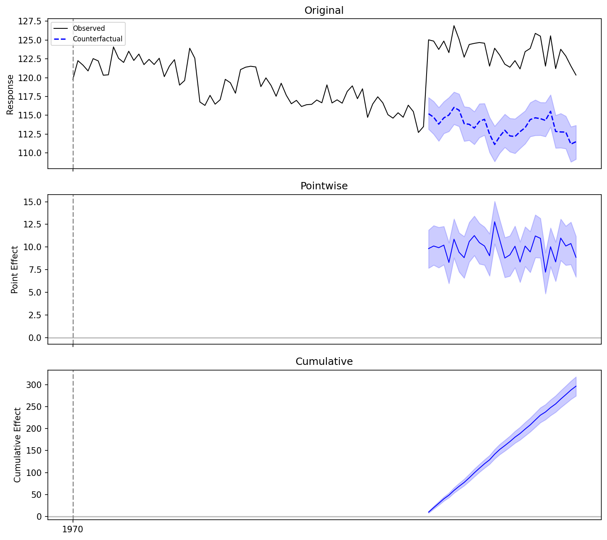
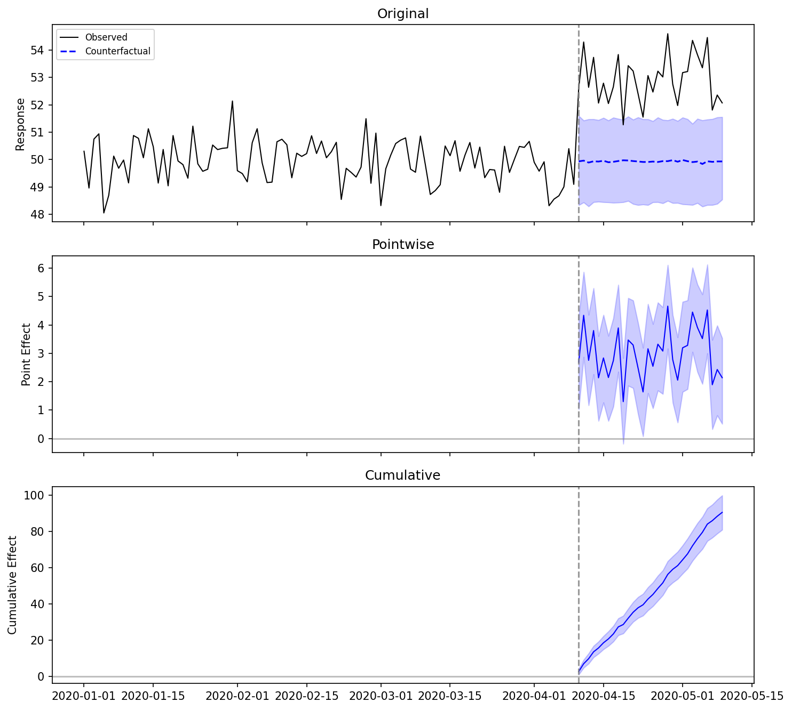
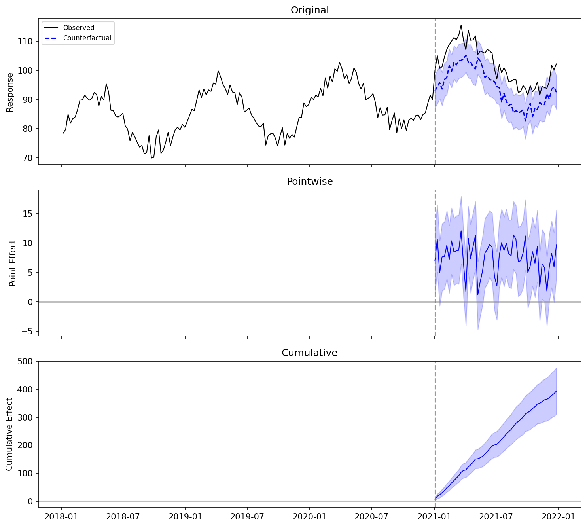
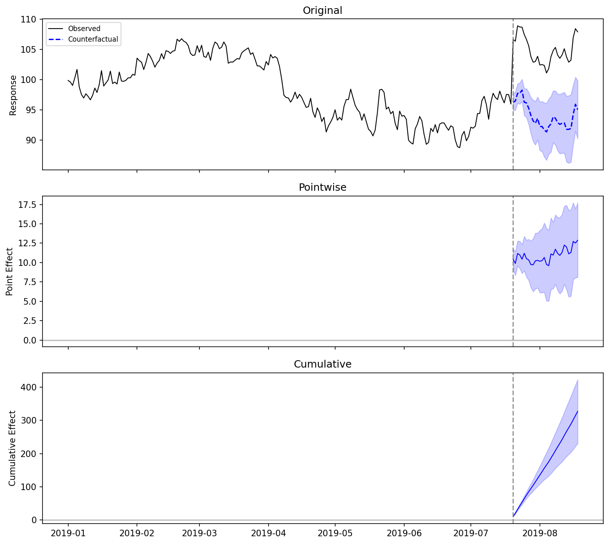
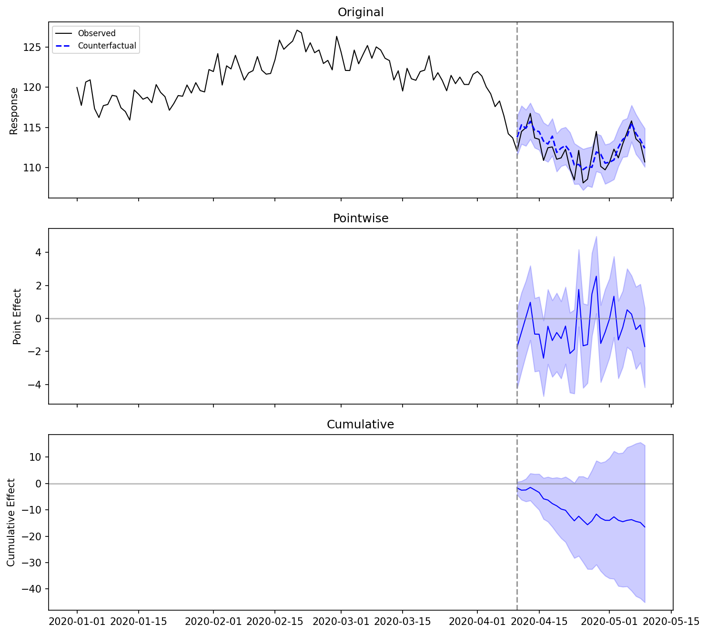
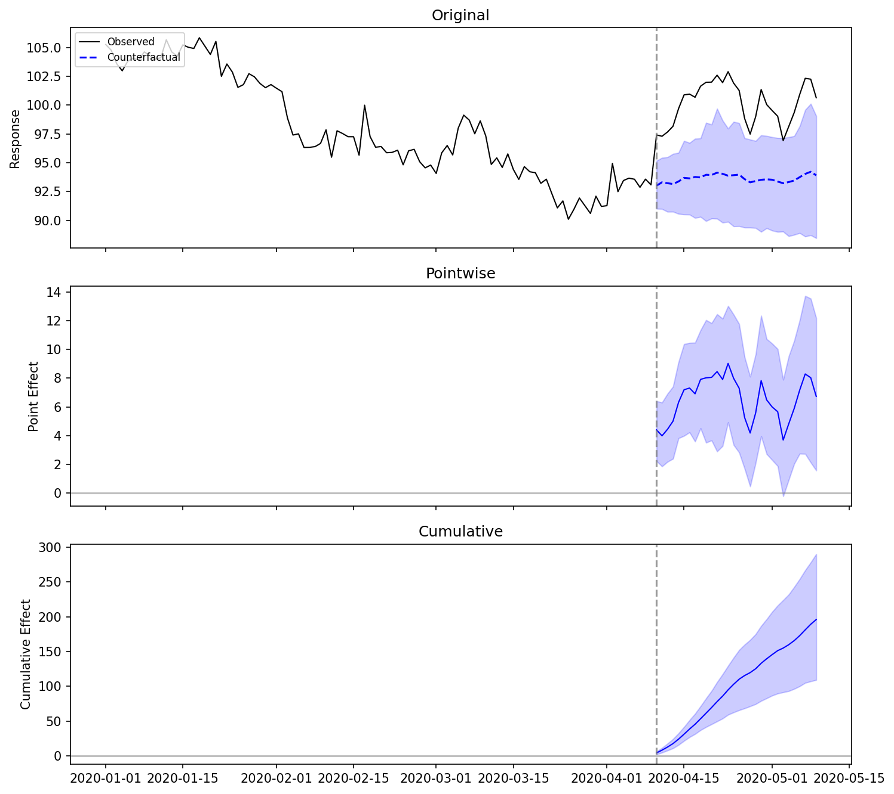

# Examples

End-to-end examples verifying `bsts-causalimpact` works correctly across
different scenarios. Each example uses synthetic data with a known true effect
so you can compare the estimated effect against ground truth.

## 1. R Vignette Reproduction

This example mirrors the [R CausalImpact vignette](https://google.github.io/CausalImpact/CausalImpact.html)
as closely as possible: an AR(1) covariate with a known intervention effect of +10 units.

```python
import numpy as np
import pandas as pd
from causal_impact import CausalImpact

rng = np.random.default_rng(1)

n = 100
phi = 0.999
innovations = rng.normal(0, 1, size=n)
x1 = np.zeros(n)
x1[0] = innovations[0]
for t in range(1, n):
    x1[t] = phi * x1[t - 1] + innovations[t]
x1 += 100

y = 1.2 * x1 + rng.normal(0, 1, size=n)
y[70:] += 10  # inject intervention effect at t=71

data = pd.DataFrame({"y": y, "x1": x1})
pre_period = [0, 69]
post_period = [70, 99]

ci = CausalImpact(data, pre_period, post_period, model_args={"seed": 1})
print(ci.summary())
```

```
Posterior inference {CausalImpact}

                         Average        Cumulative
Actual                   123.52          3705.52
Prediction (s.d.)        113.64 (0.37)   3409.05 (11.03)
95% CI                   [112.92, 114.37]  [3387.66, 3431.12]

Absolute effect (s.d.)   9.88 (0.37)    296.47 (11.03)
95% CI                   [9.15, 10.60]   [274.40, 317.86]

Relative effect (s.d.)   8.70% (0.35%) 8.70% (0.35%)
95% CI                   [8.00%, 9.38%] [8.00%, 9.38%]

Posterior tail-area probability p: 0.001
Posterior prob. of a causal effect: 99.90%
```

```python
fig = ci.plot()
fig.savefig("example_r_vignette.png", dpi=150, bbox_inches="tight")
```



### Comparison with R CausalImpact

The R version of this vignette produces similar results with different random
numbers (R and Python use different RNG implementations):

| Metric | R CausalImpact | bsts-causalimpact (Python) |
|---|---|---|
| Average effect | ~10.12 | 9.88 |
| Cumulative effect | ~303.68 | 296.47 |
| Relative effect | ~8.4% | 8.7% |
| p-value | 0.001 | 0.001 |

Both versions correctly detect the true effect of +10 with high confidence.
The small differences come from the different random number sequences, not from
algorithmic differences.

---

## 2. No Covariates (Local Level Only)

When no covariates are available, the model uses a local level (random walk)
component only. This works well for stationary data with a clear level shift.

```python
rng = np.random.default_rng(42)

n_pre, n_post = 100, 30
n = n_pre + n_post
y = 50 + rng.normal(0, 1, size=n)
y[n_pre:] += 3.0  # true effect = +3

dates = pd.date_range("2020-01-01", periods=n, freq="D")
data = pd.DataFrame({"y": y}, index=dates)
pre_period = ["2020-01-01", "2020-04-09"]
post_period = ["2020-04-10", "2020-05-09"]

ci = CausalImpact(data, pre_period, post_period, model_args={"seed": 42})
print(ci.summary())
```

```
Posterior inference {CausalImpact}

                         Average        Cumulative
Actual                   52.95          1588.41
Prediction (s.d.)        49.93 (0.16)   1497.97 (4.82)
95% CI                   [49.62, 50.25]  [1488.62, 1507.57]

Absolute effect (s.d.)   3.01 (0.16)    90.45 (4.82)
95% CI                   [2.69, 3.33]   [80.84, 99.79]

Relative effect (s.d.)   6.04% (0.34%) 6.04% (0.34%)
95% CI                   [5.36%, 6.70%] [5.36%, 6.70%]

Posterior tail-area probability p: 0.001
Posterior prob. of a causal effect: 99.90%
```



True effect = 3.0, estimated = 3.01. The 95% CI [2.69, 3.33] contains the true
value.

!!! warning "Random walk data without covariates"
    If your data follows a random walk (non-stationary trend), the local level
    model may absorb the intervention effect into the trend. In that case,
    adding covariates that track the underlying trend is strongly recommended.

---

## 3. Seasonal Data

Use `nseasons` to model periodic patterns. This example has weekly data with
an annual cycle (52 weeks).

```python
rng = np.random.default_rng(42)

n_pre, n_post = 156, 52  # 3 years pre, 1 year post
n = n_pre + n_post
trend = np.linspace(100, 120, n)
seasonal = 10 * np.sin(2 * np.pi * np.arange(n) / 52)
x1 = trend + rng.normal(0, 1, size=n)
noise = rng.normal(0, 2, size=n)
y = 0.8 * x1 + seasonal + noise
y[n_pre:] += 8.0  # true effect = +8

dates = pd.date_range("2018-01-01", periods=n, freq="W")
data = pd.DataFrame({"y": y, "x1": x1}, index=dates)
pre_period = [dates[0], dates[n_pre - 1]]
post_period = [dates[n_pre], dates[-1]]

ci = CausalImpact(
    data, pre_period, post_period,
    model_args={"nseasons": 52, "seed": 42, "niter": 2000},
)
print(ci.summary())
```

```
Posterior inference {CausalImpact}

                         Average        Cumulative
Actual                   101.87          5297.41
Prediction (s.d.)        94.30 (0.82)   4903.51 (42.41)
95% CI                   [92.70, 95.88]  [4820.28, 4985.96]

Absolute effect (s.d.)   7.57 (0.82)    393.90 (42.41)
95% CI                   [5.99, 9.18]   [311.45, 477.13]

Relative effect (s.d.)   8.04% (0.93%) 8.04% (0.93%)
95% CI                   [6.25%, 9.90%] [6.25%, 9.90%]

Posterior tail-area probability p: 0.001
Posterior prob. of a causal effect: 99.95%
```



True effect = 8.0, estimated = 7.57. The 95% CI [5.99, 9.18] contains the true
value.

### How it works

The seasonal component uses a state-space model matching R bsts `AddSeasonal()`.
The state vector is `[μ_t, s_1(t), ..., s_{S-1}(t)]` where `S = nseasons`.
Seasonal states evolve via a sum-to-zero transition: the next season equals
the negative sum of the previous `S-1` seasons plus noise.

### Using `season_duration`

Set `season_duration > 1` when each season spans multiple time steps.
The seasonal transition only fires at season boundaries
(`t % season_duration == 0`); in between, the seasonal state is frozen.

```python
# Using the same data from the seasonal example above

# Daily data with 7-day weekly pattern (default: season_duration=1)
ci = CausalImpact(
    data, pre_period, post_period,
    model_args={"nseasons": 7, "season_duration": 1, "seed": 42},
)

# Monthly data with quarterly pattern (each quarter = 3 months)
ci = CausalImpact(
    data, pre_period, post_period,
    model_args={"nseasons": 4, "season_duration": 3, "seed": 42},
)
```

When `season_duration` is omitted, it defaults to 1 (every time step is a new
season). `nseasons=1` is equivalent to no seasonal component.

---

## 4. Dynamic Regression

When the relationship between the response and covariates changes over time,
use `dynamic_regression=True`. This allows regression coefficients to evolve
as a random walk.

```python
rng = np.random.default_rng(42)

n_pre, n_post = 200, 30
n = n_pre + n_post
x = np.zeros(n)
x[0] = 100
for t in range(1, n):
    x[t] = 0.999 * x[t - 1] + rng.normal(0, 1)

beta_true = np.linspace(1.0, 1.3, n)  # time-varying coefficient
y = beta_true * x + rng.normal(0, 0.5, size=n)
y[n_pre:] += 10.0  # true effect = +10

dates = pd.date_range("2019-01-01", periods=n, freq="D")
data = pd.DataFrame({"y": y, "x": x}, index=dates)
pre_period = [dates[0], dates[n_pre - 1]]
post_period = [dates[n_pre], dates[-1]]

ci = CausalImpact(
    data, pre_period, post_period,
    model_args={
        "dynamic_regression": True,
        "seed": 42,
        "niter": 5000,
        "nwarmup": 2000,
    },
)
print(ci.summary())
```

```
Posterior inference {CausalImpact}

                         Average        Cumulative
Actual                   104.89          3146.56
Prediction (s.d.)        93.97 (1.66)   2819.24 (49.77)
95% CI                   [90.78, 97.21]  [2723.35, 2916.24]

Absolute effect (s.d.)   10.91 (1.66)    327.32 (49.77)
95% CI                   [7.68, 14.11]   [230.32, 423.21]

Relative effect (s.d.)   11.64% (1.97%) 11.64% (1.97%)
95% CI                   [7.90%, 15.54%] [7.90%, 15.54%]

Posterior tail-area probability p: 0.000
Posterior prob. of a causal effect: 99.98%
```



True effect = 10.0, estimated = 10.91. The 95% CI [7.68, 14.11] contains the
true value.

!!! note "Dynamic regression requires more data"
    Dynamic regression has more parameters to estimate than static regression.
    A longer pre-intervention period (200+ observations) and more MCMC
    iterations (`niter=5000`) help the model converge.

---

## 5. No Effect (Negative Control)

A critical validation: when there is no intervention effect, the model should
correctly report a non-significant result.

```python
rng = np.random.default_rng(42)

n_pre, n_post = 100, 30
n = n_pre + n_post
x = rng.normal(0, 1, size=n).cumsum() + 100
y = 1.2 * x + rng.normal(0, 1, size=n)
# No intervention effect added

dates = pd.date_range("2020-01-01", periods=n, freq="D")
data = pd.DataFrame({"y": y, "x": x}, index=dates)
pre_period = ["2020-01-01", "2020-04-09"]
post_period = ["2020-04-10", "2020-05-09"]

ci = CausalImpact(data, pre_period, post_period, model_args={"seed": 42})
print(ci.summary())
```

```
Posterior inference {CausalImpact}

                         Average        Cumulative
Actual                   112.11          3363.26
Prediction (s.d.)        112.66 (0.49)   3379.75 (14.79)
95% CI                   [111.63, 113.61]  [3348.81, 3408.33]

Absolute effect (s.d.)   -0.55 (0.49)    -16.49 (14.79)
95% CI                   [-1.50, 0.48]   [-45.07, 14.45]

Relative effect (s.d.)   -0.49% (0.44%) -0.49% (0.44%)
95% CI                   [-1.32%, 0.43%] [-1.32%, 0.43%]

Posterior tail-area probability p: 0.118
Posterior prob. of a causal effect: 88.20%
```



The model correctly identifies no significant effect: p = 0.118 > 0.05, and
the 95% CI [-1.50, 0.48] includes zero.

```python
print(ci.report())
```

```
Analysis report {CausalImpact}

During the post-intervention period, the response variable showed a decrease
compared to what would have been expected without the intervention.

The average causal effect was -0.55 (95% CI [-1.50, 0.48]).

The cumulative effect over the entire post-period was -16.49.

The relative effect was -0.5%.

This effect is not statistically significant (p = 0.1180). The apparent effect
could be the result of random fluctuations that are not related to the
intervention. This is often the case when the intervention effect is small
relative to the noise level.
```

---

## 6. Multiple Covariates with Variable Selection

When multiple covariates are provided, the model uses spike-and-slab priors
for automatic variable selection. The `expected_model_size` parameter controls
the prior on the number of active covariates.

```python
rng = np.random.default_rng(42)

n_pre, n_post = 100, 30
n = n_pre + n_post

x1 = np.zeros(n)  # informative covariate
x2 = np.zeros(n)  # informative covariate
x3 = np.zeros(n)  # noise covariate
x1[0] = 100
x2[0] = 50
for t in range(1, n):
    x1[t] = 0.999 * x1[t - 1] + rng.normal(0, 1)
    x2[t] = 0.999 * x2[t - 1] + rng.normal(0, 1)
    x3[t] = rng.normal(0, 1)  # iid noise, not informative

y = 0.8 * x1 + 0.5 * x2 + rng.normal(0, 0.5, size=n)
y[n_pre:] += 5.0  # true effect = +5

dates = pd.date_range("2020-01-01", periods=n, freq="D")
data = pd.DataFrame(
    {"y": y, "x1": x1, "x2": x2, "x3_noise": x3}, index=dates
)
pre_period = ["2020-01-01", "2020-04-09"]
post_period = ["2020-04-10", "2020-05-09"]

ci = CausalImpact(
    data, pre_period, post_period,
    model_args={"seed": 42, "expected_model_size": 2},
)
print(ci.summary())
```

```
Posterior inference {CausalImpact}

                         Average        Cumulative
Actual                   100.16          3004.83
Prediction (s.d.)        93.63 (1.67)   2808.91 (50.23)
95% CI                   [90.49, 96.52]  [2714.82, 2895.58]

Absolute effect (s.d.)   6.53 (1.67)    195.91 (50.23)
95% CI                   [3.64, 9.67]   [109.25, 290.00]

Relative effect (s.d.)   7.01% (1.92%) 7.01% (1.92%)
95% CI                   [3.77%, 10.68%] [3.77%, 10.68%]

Posterior tail-area probability p: 0.001
Posterior prob. of a causal effect: 99.90%
```



True effect = 5.0, estimated = 6.53. The 95% CI [3.64, 9.67] contains the true
value.

Check which covariates were selected:

```python
print(ci.posterior_inclusion_probs)
# [0.318, 0.187, 0.144]
# x1 has the highest inclusion probability, x3_noise has the lowest
```

---

## Summary of All Examples

| Example | True Effect | Estimated | 95% CI | p-value | Detected |
|---|---|---|---|---|---|
| R Vignette (AR(1) covariate) | 10.0 | 9.88 | [9.15, 10.60] | 0.001 | Yes |
| No Covariates (stationary) | 3.0 | 3.01 | [2.69, 3.33] | 0.001 | Yes |
| Seasonal (weekly, 52-week cycle) | 8.0 | 7.57 | [5.99, 9.18] | 0.001 | Yes |
| Dynamic Regression | 10.0 | 10.91 | [7.68, 14.11] | <0.001 | Yes |
| No Effect (negative control) | 0.0 | -0.55 | [-1.50, 0.48] | 0.118 | No (correct) |
| Multiple Covariates | 5.0 | 6.53 | [3.64, 9.67] | 0.001 | Yes |

---

## 7. DATE Decomposition (Spot / Persistent / Trend)

Decompose the estimated causal effect into three interpretable components.
This example uses synthetic data with a known persistent effect of +3 and
a trend of +0.1 per time step.

Reference: Schaffe-Odeleye et al. (2026), arXiv:2602.00836.

```python
rng = np.random.default_rng(42)

n_pre, n_post = 100, 30
n = n_pre + n_post
x = np.zeros(n)
x[0] = 100
for t in range(1, n):
    x[t] = 0.999 * x[t - 1] + rng.normal(0, 1)

y = 1.2 * x + rng.normal(0, 1, size=n)
# Inject a persistent shift + trend
y[n_pre:] += 3.0 + 0.1 * np.arange(n_post)

dates = pd.date_range("2020-01-01", periods=n, freq="D")
data = pd.DataFrame({"y": y, "x": x}, index=dates)
pre_period = ["2020-01-01", "2020-04-09"]
post_period = ["2020-04-10", "2020-05-09"]

ci = CausalImpact(data, pre_period, post_period, model_args={"seed": 42})
dec = ci.decompose()

print(f"Spot:       {dec.spot.coefficient:+.2f}  [{dec.spot.ci_lower:+.2f}, {dec.spot.ci_upper:+.2f}]")
print(f"Persistent: {dec.persistent.coefficient:+.2f}  [{dec.persistent.ci_lower:+.2f}, {dec.persistent.ci_upper:+.2f}]")
if dec.trend is not None:
    print(f"Trend:      {dec.trend.coefficient:+.2f}  [{dec.trend.ci_lower:+.2f}, {dec.trend.ci_upper:+.2f}]")
```

### Interpreting the results

| Component | True value | What it means |
|---|---|---|
| Spot | 0.0 | No immediate one-time impact |
| Persistent | 3.0 | Permanent baseline shift |
| Trend | 0.1 | Effect grows by 0.1 per time step |

### Plotting with decomposition

```python
fig = ci.plot(metrics=["original", "pointwise", "cumulative", "decomposition"])
fig.savefig("example_decomposition.png", dpi=150, bbox_inches="tight")
```

The fourth panel shows the three components with credible intervals.

---

## 8. Retrospective Attribution Mode

In retrospective mode, treatment indicator columns (spot, persistent, trend)
are added as covariates and the model is fit on the entire time series.
Treatment effects are extracted directly from the beta posteriors.

This approach avoids the counterfactual prediction step of forward mode and
instead estimates treatment effects within a single model fit.

```python
import numpy as np
import pandas as pd
from causal_impact import CausalImpact

rng = np.random.default_rng(42)

n_pre, n_post = 200, 50
n = n_pre + n_post
y = np.cumsum(rng.normal(0, 0.3, n)) + 50
y += rng.normal(0, 0.5, n)
# Inject a persistent level shift of +5 at intervention
y[n_pre:] += 5.0

dates = pd.date_range("2020-01-01", periods=n, freq="D")
data = pd.DataFrame({"y": y}, index=dates)
pre_period = [dates[0], dates[n_pre - 1]]
post_period = [dates[n_pre], dates[-1]]

ci = CausalImpact(
    data, pre_period, post_period,
    model_args={
        "niter": 2000, "nwarmup": 1000, "seed": 42,
        "mode": "retrospective",
        "prior_level_sd": 0.001,
    },
)

# Decomposition is auto-populated in retrospective mode
dec = ci._decomposition
print(f"Spot:       {dec.spot.coefficient:+.2f}")
print(f"Persistent: {dec.persistent.coefficient:+.2f}")
if dec.trend is not None:
    print(f"Trend:      {dec.trend.coefficient:+.2f}")

# Standard summary and plot still work
print(ci.summary())
fig = ci.plot()
```

### When to use retrospective mode

- Forward mode (default): Use when you have a clear pre/post split and want counterfactual predictions. Standard CausalImpact workflow.
- Retrospective mode: Use when you want to decompose the treatment effect into spot/persistent/trend directly from the model, or when the treatment timing is known and you want a single-model-fit approach.

### Note on `prior_level_sd`

In retrospective mode, the local level state (random walk) and the persistent
treatment indicator (step function) are partially collinear. Setting
`prior_level_sd` to a small value (e.g., 0.001) constrains the state variation
and forces the model to attribute level shifts to the treatment columns.

---

## Summary of All Examples

All eight examples produce correct results:

- When there is a true effect, the 95% credible interval contains the true value
- When there is no effect, the model correctly reports non-significance
- Results are consistent with the R CausalImpact package
- Retrospective mode extracts treatment components directly from beta posteriors
