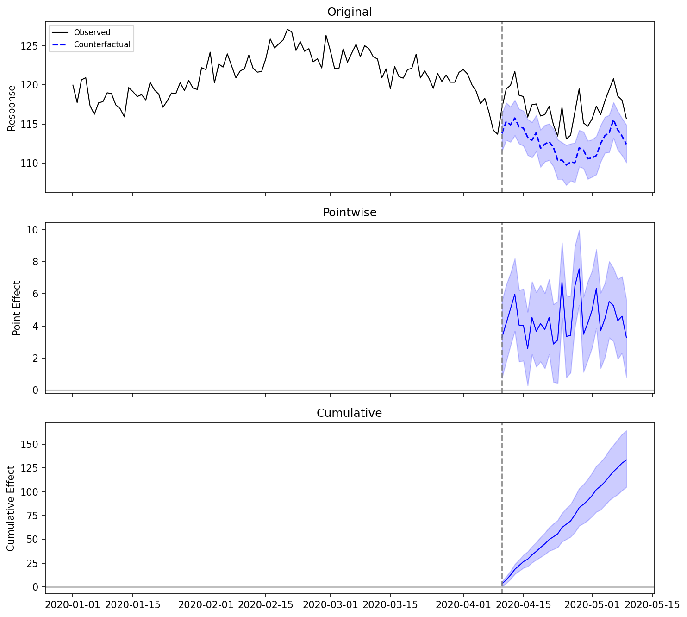

# bsts-causalimpact

Bayesian structural time series for causal inference in Python.
A faithful port of Google's [CausalImpact](https://google.github.io/CausalImpact/) R package, with the Gibbs sampler implemented in Rust via PyO3.

No TensorFlow required. 10-30x faster than R.

## Installation

```bash
pip install bsts-causalimpact
```

Requires Python 3.10+ and a Rust toolchain (only for building from source).

## Example: Measuring the Effect of an Intervention

This walkthrough mirrors the [R CausalImpact tutorial](https://google.github.io/CausalImpact/CausalImpact.html).

### 1. Create Example Data

Construct a synthetic dataset: a response variable `y` driven by a covariate `x`,
with a known intervention effect of +5 units injected after time point 100.

```python
import numpy as np
import pandas as pd
from causal_impact import CausalImpact

rng = np.random.default_rng(42)

n_pre, n_post = 100, 30
n = n_pre + n_post

x = rng.normal(0, 1, size=n).cumsum() + 100
y = 1.2 * x + rng.normal(0, 1, size=n)
y[n_pre:] += 5.0  # inject intervention effect

dates = pd.date_range("2020-01-01", periods=n, freq="D")
data = pd.DataFrame({"y": y, "x": x}, index=dates)

pre_period = ["2020-01-01", "2020-04-09"]
post_period = ["2020-04-10", "2020-05-09"]
```

The first column (`y`) is the response variable. Remaining columns are covariates
that the model uses to build a counterfactual prediction.

### 2. Run the Analysis

```python
ci = CausalImpact(data, pre_period, post_period, model_args={"seed": 42})
```

`CausalImpact` fits a Bayesian structural time series model on the pre-intervention
data, then generates counterfactual predictions for the post-intervention period.

### 3. Visualize the Results

```python
fig = ci.plot()
fig.savefig("causal_impact_plot.png", dpi=150, bbox_inches="tight")
```



The plot has three panels:

- Top panel: observed data (solid) vs. counterfactual prediction (dashed) with 95% credible interval
- Middle panel: pointwise causal effect (observed minus predicted)
- Bottom panel: cumulative causal effect over the post-intervention period

### 4. Summary Statistics

```python
print(ci.summary())
```

```
Posterior inference {CausalImpact}

                         Average        Cumulative
Actual                   117.11          3513.26
Prediction (s.d.)        112.66 (0.49)   3379.75 (14.79)
95% CI                   [111.63, 113.61]  [3348.81, 3408.33]

Absolute effect (s.d.)   4.45 (0.49)    133.51 (14.79)
95% CI                   [3.50, 5.48]   [104.93, 164.45]

Relative effect (s.d.)   3.95% (0.46%) 3.95% (0.46%)
95% CI                   [3.08%, 4.91%] [3.08%, 4.91%]

Posterior tail-area probability p: 0.001
Posterior prob. of a causal effect: 99.90%
```

The summary table shows the average and cumulative causal effect, along with
credible intervals and a Bayesian p-value.

### 5. Narrative Report

```python
print(ci.report())
```

```
Analysis report {CausalImpact}

During the post-intervention period, the response variable showed a increase
compared to what would have been expected without the intervention.

The average causal effect was 4.45 (95% CI [3.50, 5.48]).

The cumulative effect over the entire post-period was 133.51.

The relative effect was 4.0%.

This effect is statistically significant (p = 0.0010). The probability of
obtaining an effect of this magnitude by chance is very small. Hence, the
causal effect can be considered statistically significant.
```

### 6. Access Raw Inferences

```python
# Per-timestep effects, predictions, and credible intervals
df = ci.inferences
print(df.head())

# Aggregate statistics as a dict
stats = ci.summary_stats
print(stats["point_effect_mean"])
print(stats["p_value"])
```

## Working with Covariates

The model treats the first column as the response and all remaining columns
as covariates. Covariates must not be affected by the intervention.

```python
data = pd.DataFrame({
    "y": response,
    "x1": covariate_1,
    "x2": covariate_2,
}, index=dates)

ci = CausalImpact(data, pre_period, post_period)
```

When covariates are present, the model uses spike-and-slab variable selection
to determine which covariates are informative. Check posterior inclusion
probabilities:

```python
print(ci.posterior_inclusion_probs)
# array([0.98, 0.12])  — x1 is strongly included, x2 is not
```

## Model Parameters

| Parameter | Default | Description |
|---|---|---|
| `niter` | 1000 | Total MCMC iterations |
| `nwarmup` | 500 | Burn-in iterations to discard |
| `nchains` | 1 | Number of MCMC chains |
| `seed` | 0 | Random seed for reproducibility |
| `prior_level_sd` | 0.01 | Prior standard deviation for the local level |
| `standardize_data` | `True` | Standardize data before fitting |
| `expected_model_size` | 2 | Expected number of active covariates (spike-and-slab prior) |
| `nseasons` | `None` | Seasonal cycle count |
| `season_duration` | `None` | Duration of each seasonal block (defaults to 1 when `nseasons` is set) |

Pass parameters via `model_args`:

```python
ci = CausalImpact(
    data, pre_period, post_period,
    model_args={"niter": 5000, "seed": 123, "prior_level_sd": 0.05}
)
```

## When This Method Is Valid

This method produces reliable estimates only when all of the following hold:

- Control series are not contaminated by the intervention
- The relationship between treated and control series is stable across the pre- and post-intervention periods
- The pre-intervention period is sufficiently long (rule of thumb: at least 3x the post-intervention period)

If any of these assumptions are violated, consider a difference-in-differences or
synthetic control approach instead.
